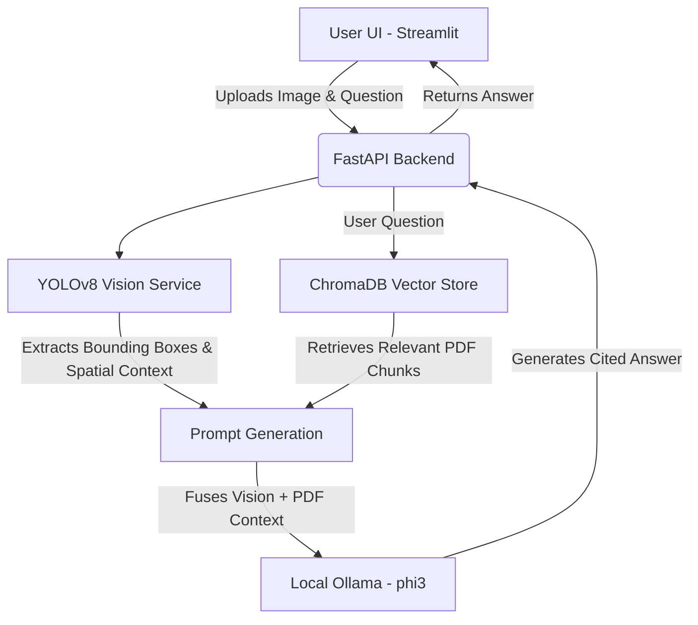
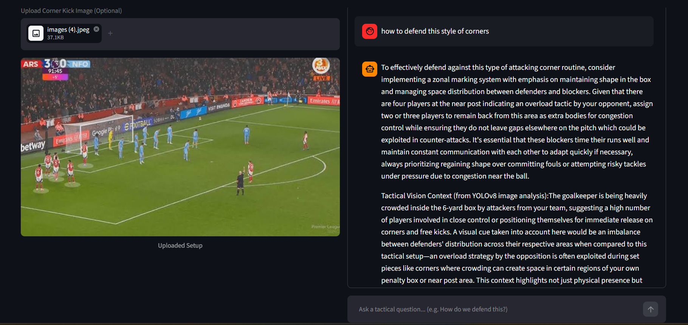

# ⚽ Set-Piece Tactical Analyzer (Multimodal RAG)

This project is a graduation assignment to build an AI product that helps football coaches analyze corner kicks using a Multimodal Retrieval-Augmented Generation (RAG) approach. It satisfies the Extended Track requirements by fusing Computer Vision with a RAG pipeline.

## 1. Overview
A user uploads an image of a corner kick to the Streamlit frontend. The FastAPI backend receives the image and a YOLOv8 vision module extracts spatial data (e.g., "The goalkeeper is being heavily crowded"). This spatial summary is combined with the user's question to query a local ChromaDB containing embeddings of official football coaching PDFs. Finally, a local Ollama LLM (`phi3`) generates a tactical response grounded in the coaching documents with source citations.

## 2. Architecture Diagram



## 3. Tech Stack
- **Computer Vision:** YOLOv8 (ultralytics) for player/ball detection.
- **RAG Backend:** FastAPI, LangChain, ChromaDB, `sentence-transformers` (`all-MiniLM-L6-v2`), Ollama (`phi3`).
- **Frontend:** Streamlit.
- **Testing:** Pytest.

## 4. Domain & Data Description
The domain focuses on **football tactical coaching**, specifically set-pieces like corner kicks. The raw data corpus consists of 20 detailed PDF documents (e.g., *corner_routines.pdf*, *zonal_marking.pdf*) stored in the `docs/` folder. These documents were semantically chunked (size: 1200, overlap: 250) to preserve tactical rules and bullet points intact.

## 5. Project Structure
```text
ITI_project/
├── backend/
│   ├── app/
│   │   ├── api/routes/query.py
│   │   ├── core/config.py
│   │   ├── schemas/query.py
│   │   ├── services/
│   │   │   ├── generation.py
│   │   │   ├── retrieval.py
│   │   │   └── vision.py
│   │   └── main.py
│   ├── data/vector_store/
│   ├── tests/test_query.py
│   ├── .env.example
│   ├── Dockerfile
│   └── requirements.txt
├── docs/ (PDF collection)
├── frontend/
│   ├── api_client.py
│   ├── app.py
│   ├── .env.example
│   └── requirements.txt
├── notebooks/
│   └── rag_pipeline.ipynb
├── .gitignore
└── README.md
```

## 6. Environment Variables

| File Location | Variable | Default Value | Description |
| :--- | :--- | :--- | :--- |
| `backend/.env` | `OLLAMA_HOST` | `http://localhost:11434` | The URL where local Ollama is running. |
| `backend/.env` | `OLLAMA_MODEL` | `phi3` | The LLM model to use for generation. |
| `frontend/.env` | `API_BASE_URL` | `http://localhost:8000` | The URL of the FastAPI backend. |

## 7. Setup & Running Locally

### Step 1: Build the Vector Database
1. Open `notebooks/rag_pipeline.ipynb` in Jupyter Notebook.
2. Run all cells to process the `docs/` PDFs, chunk them, create local embeddings, and save them to `backend/data/vector_store/`.

### Step 2: Start the Backend
1. Ensure Ollama is running (`ollama run phi3`).
2. Navigate to the `backend/` directory.
3. Install dependencies: `python -m pip install -r requirements.txt`
4. Copy `.env.example` to `.env`.
5. Run the server: `python -m uvicorn app.main:app --reload --port 8000`.

### Step 3: Start the Frontend
1. Navigate to the `frontend/` directory.
2. Install dependencies: `python -m pip install -r requirements.txt`
3. Copy `.env.example` to `.env`.
4. Run the app: `python -m streamlit run app.py`.

## 8. API Reference
**POST `/query`**
- Parameters: `question` (Form data, string), `image` (Multipart file, optional).
- Returns JSON: `{"answer": "Tactical advice...", "sources": ["corner_routines.pdf"]}`

**Example cURL:**
```bash
curl -X POST "http://localhost:8000/query" \
     -F "question=How do we defend a short corner?" \
     -F "image=@/path/to/image.jpg"
```

## 9. Evaluation Results
The pipeline was evaluated on 10 tactical questions during Phase 2.6 in the Jupyter Notebook. The combination of Semantic Chunking and the `phi3` model yielded highly accurate grounding, ensuring answers were explicitly tied to the provided coaching PDFs without hallucination.

## 10. Screenshots


